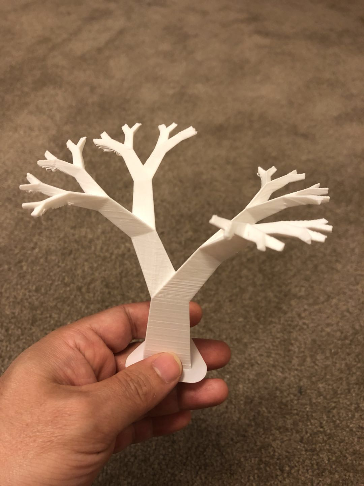
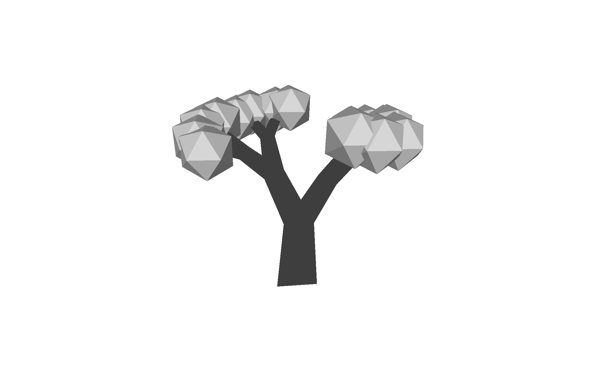
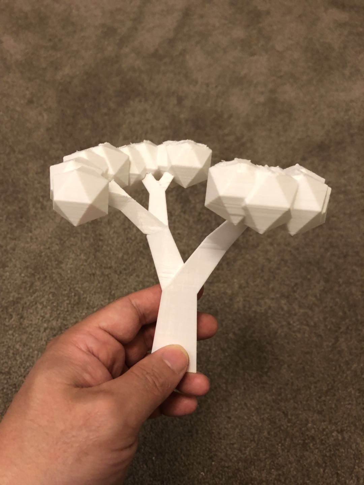

# 3d modeling of tree and create mesh for 3D printing

#### to get usage information
```
python make_tree_L_system_3d.py -h
```

#### example commond line
```
python make_tree_L_system_3d.py
```
#### make a 5 level tree
```
python make_tree_L_system_3d.py -l=5 -w=10 -n=30 -i=0.7 -p=0.7 -e=30 -a=30 -t=30 -o=tree2_5_10_30
```
### 3D model and 3D printed model



#### make a 5 level tree with leave
```
python make_tree_L_system_3d.py -l=4 -w=10 -n=30 -i=0.7 -p=0.7 -e=30 -a=30 -t=30 -f -o=tree2_4_10_30_leaf
```
### 3D model and 3D printed model


