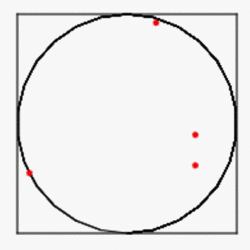

# Calculating pi and e in Euler's Identity
Euler's Identity is:  
  
    
   
  
    
It show the beauty of math. There are five fundamental constants in mathematics.  
Here we try to calculate pi and e using computer.  

#### calculate pi using Monte Carlo sampling
The area of a circle A is:  
  
If the circle has radius of 1, the area of the cirle is pi. The area of the sqaure is 4.  If we sample the area by uniformly distributed random points, the ratio of the area should be equal to the ratio of points.  
So we can compute pi by:  
              
where N is the number of sample points
```
python compute_pi_monte_carlo.py
100000 samples, calculated pi value = 3.14248 with error 0.000887346410207 compared to math.pi 3.14159265359
```
calculate pi using Monte Carlo sampling with turtle graphics
```
python compute_pi_monte_carlo_turtle.py
pi = 3.13456 with 100000 samples
```
  
MC sampling process; the points inside the circle show in red; the points outside the circle show in blue

calculate pi using Monte Carlo with numpy for speed-up
```
python compute_pi_monte_carlo_np.py
1000000000 samples, calculated pi value = 3.141608452 with error 1.57984102067e-05 compared to math.pi 3.14159265359
```
#### calculate pi using math

compute pi using Nilakantha series  
  
with the module decimal for high precision float number  
```
python compute_pi_math.py
PI value = 3.14159265358979348693
```
#### calculate e using math
Euler's number e, the base of natural logs
e is the sum of this infinite series:  

```
python compute_e.py
Eulers number = 2.71828182846
```
High precision version using the module decimal for high precision float number 
```
python compute_e_high_precision.py
Eulers number with 50 digit = 2.71828182845904523536028747135266249775724709369995
```
