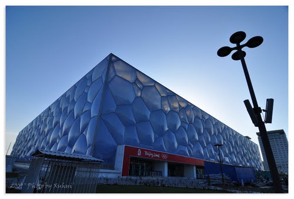
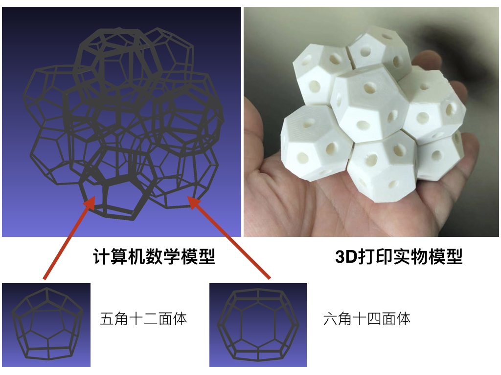
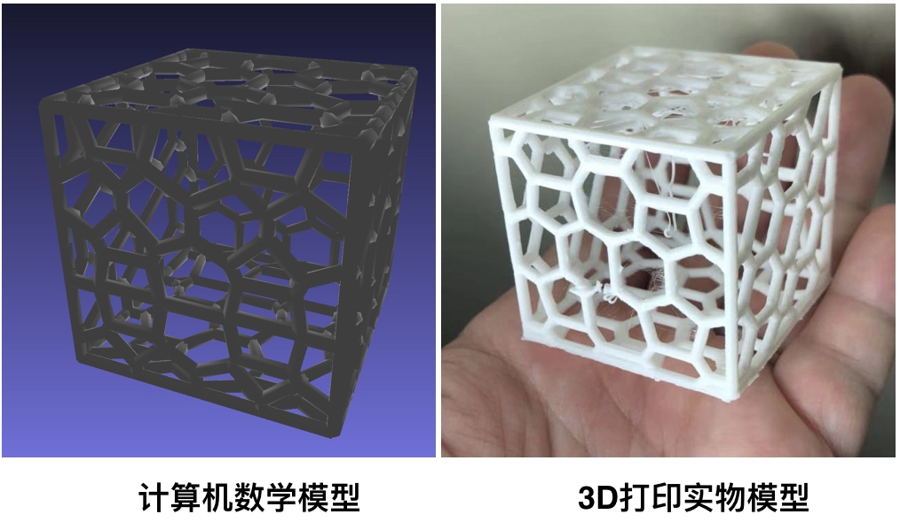
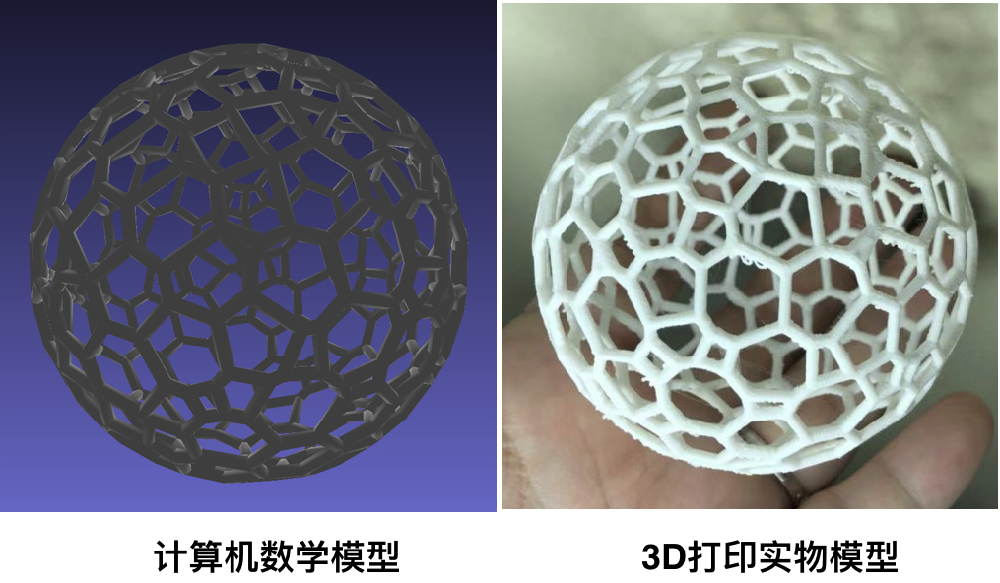

# Modeling and 3D printing Water Cube Model 
  
Here, we tried to figure out the structure of Water Cube Building in Beijing.  
   

#### Weaire-Phelan Structure
The building of Water Cube in Beijing is made of the Weaire-Phelan structure, which is made up of wonky dodecahedrons with pentagonal faces
and tetradecahedrons with 2 hexagonal and 12 pentagonal faces (bottom right).  
To make the bubble blocks, run  
```
make_bubbles_mesh.py
```
The resuling structure model and 3D prints is showed below:  
   

#### Water Cubes  
To make Water Cube structure, run  
```
cut_cube_bubbles_mesh.py
```
The resuling structure model and 3D prints is showed below:  
   
   
#### water Sphere
To make Water Sphere structure, run  
```
cut_sphere_bubbles_mesh.py
```
The resuling structure model and 3D prints is showed below:  
   

