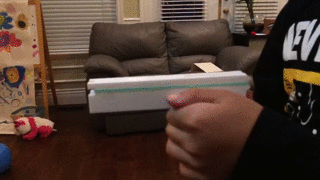
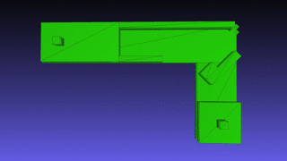
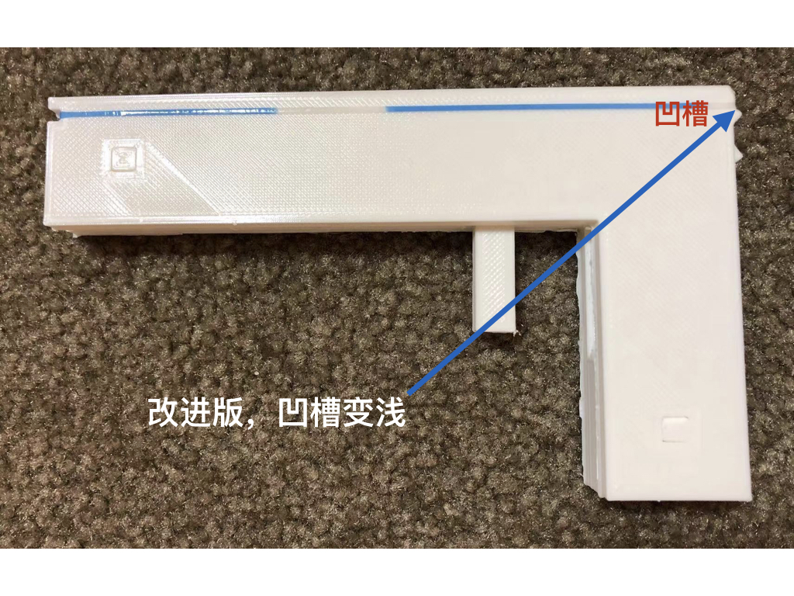

# Modeling and 3D printing rubber gun toy 
  
Here, we tried to design and produce a rubber gun toy as showed in below picture.  
  


#### Design of rubber gun toy  
   
There are 4 parts for a rubber gun toy:
(1) Bottom parts in 
 

#### Modeling and 3D printed toy  
To make the input model file of bottom part for 3D printing, run the code below:  
```
make_rubber_gun_bottom.py
```
To make the input model file of top part for 3D printing, run the code below:  
```
make_rubber_gun_top.py
```
To make the input model file of trigger part for 3D printing, run the code below:  
```
make_rubber_gun_trigger_part1.py
make_rubber_gun_trigger_part2.py
```
The resuling 3D prints is showed below:  
  
