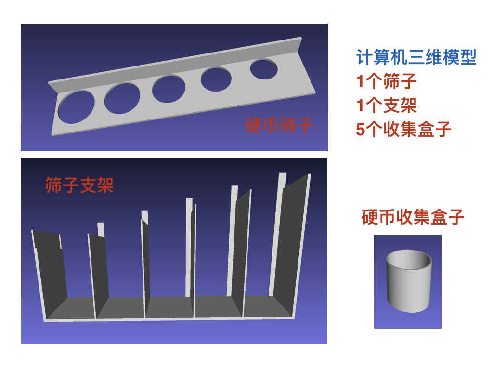
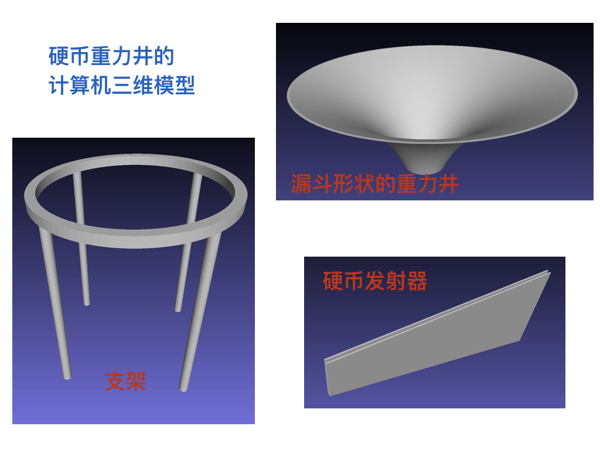
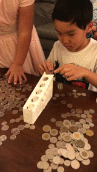

# Modeling and 3D printing coin sorter with gravity well funnel 
This toy is to sort coins and show the gravity well.  

#### Modeling and 3D printed coin sorter  
First, we make a 3D model of coin sorter by running  
```
python make_coin_sorter_version5.py
```
  
The 3D printed coin sorter is as below  
  

#### Modeling and 3D printed gravity well funnel  
First, we make a 3D model of gravity well funnel and coin launcher by running  
```
make_funnel.py  
make_funnel_stand.py  
make_funnel_launcher.py  
```
  
The 3D printed coin sorter is as below  
  

#### sorting coins  
  
The sorter can quickly separate different coins according to their size.  
  
The coins are collected by the cylinder collectors.

#### Motion in gravity well  
  
Coins can stay in different orbits based on their speed and launching angle.  
  
If the launching angle is too wide, the coin will fly away from the funnel.  
  
If the launching angle is good, the coin will stay at smaller orbit with the speed decreasing and eventually drop to the hole at bottom. 
