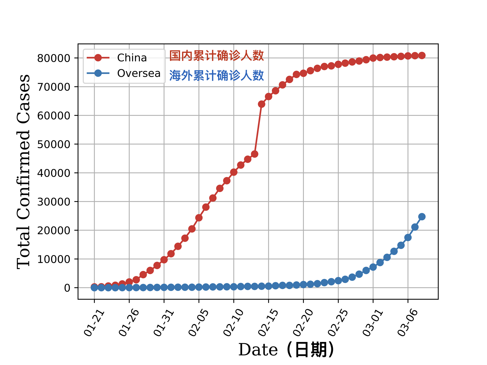
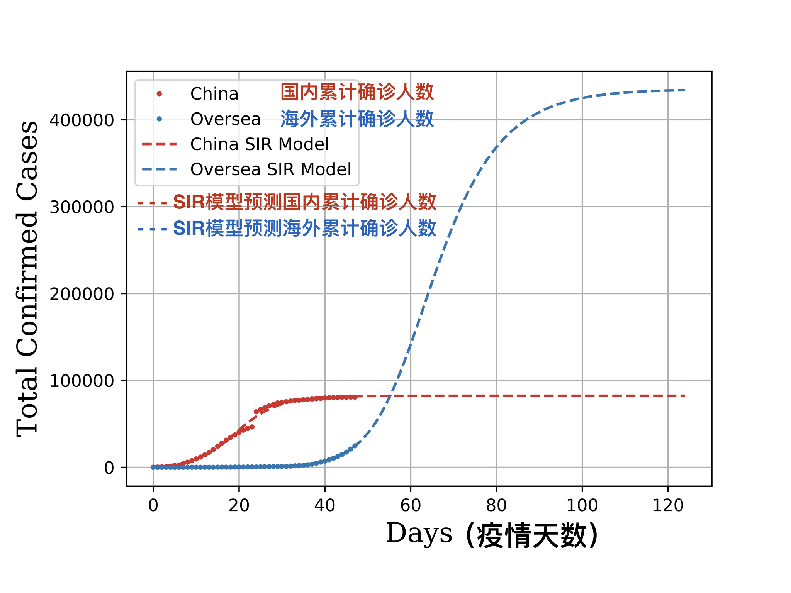
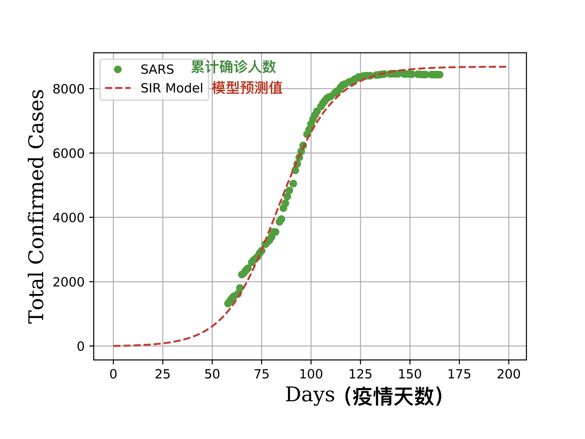
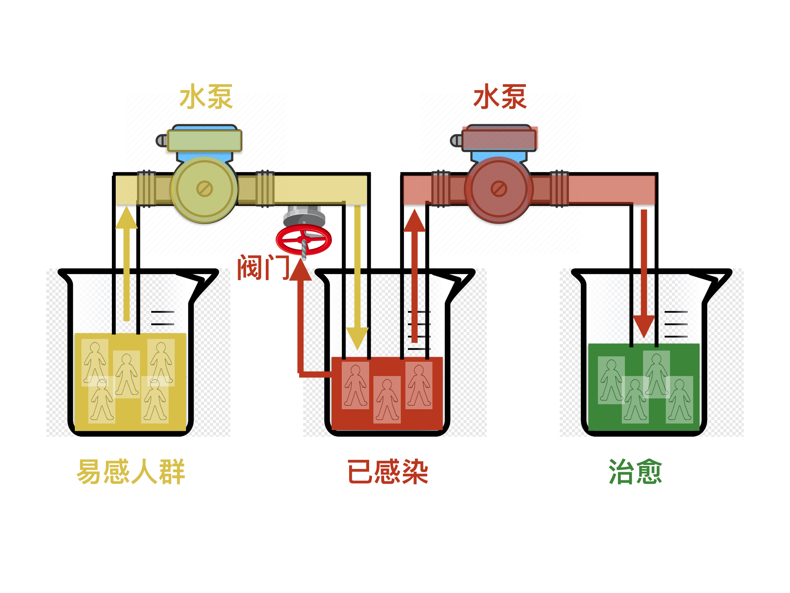

# Data analysis for COVID-19 outbreak 
The data of COVID-19 confirmed cases are fitted to SIR model. The SIR model is also validated with 2003 SARS data.
Trend of COVID-19 outbreak is predicted by SIR model.

#### The data of total confirmed cased, China VS oversea 
First, we compared the total confirmed cases for China v.s. oversea. 
```
python analysis_covid_2019.py
```
  
The red points represents the total confirmed cases in China.  
The blue points represents the total confirmed cases outside China.  

#### SIR model prediction of final confirmed cases 
Then the data are feeded to SIR model, the prediction was made.  
  
The red points represents the total confirmed cases in China.  
The blue points represents the total confirmed cases outside China.  
The red dashed line is the prediction for China based on SIR model.  
The blue dashed line is the prediction for Oversea based on SIR model.  
The final confirmed cased oversea will reach to 400K in 120 days from the outbreak.  

#### SIR Model validattion on 2003 SARS data 
  
The green points represents the total confirmed cases of 2003 SARS all over the world.  
The red dashed line is the prediction based on SIR model.  
We can see the model matched the data very well.

#### The ways to fight COVID-19 based on SIR Model 
  

